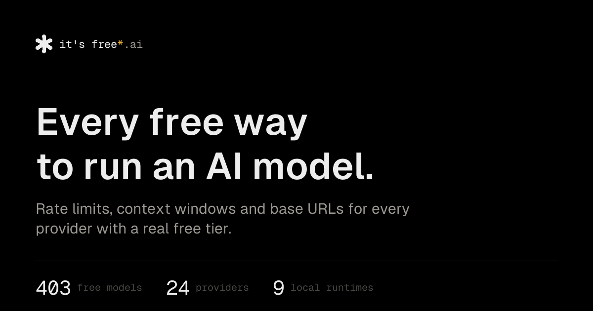

# it's free*

Every free way to run an AI model. Live at [itsfree.ai](https://itsfree.ai).

[](https://itsfree.ai)

Rate limits, context windows and base URLs for every provider with a real free tier — plus the runtimes that need no provider at all.

\* Free tiers change without warning. Check the limits before you depend on one.

## Data

The catalog is TypeScript, not a CMS. Edit the files; the pages follow.

- [`src/data/resources.ts`](src/data/resources.ts) — every entry
- [`src/data/providers.ts`](src/data/providers.ts) — limits, base URLs, last verified
- [`src/data/models.ts`](src/data/models.ts) — models with a free route
- [`src/data/collections.ts`](src/data/collections.ts) — grouped by need

## Develop

Node 22.12+ and [pnpm](https://pnpm.io).

```sh
pnpm install
pnpm dev
```

```sh
pnpm build
```

`pnpm og` and `pnpm favicons` rebuild the share cards and the icon set. Only needed when the catalog or the mark changes.
